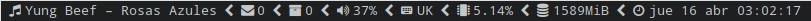

My own customized build of dwmblocks
====================================



**[dwmblocks](https://github.com/torrinfail/dwmblocks)** is a modular statusbar
for [dwm](https://dwm.suckless.org) written in C. This is my personal build,
which includes status for different system properties.

The only difference to the upstream source is that this current build (besides
my own customized statuses) supports multi-character separator between blocks.

### Dependencies

* [nerd-fonts](https://www.nerdfonts.com/): my build uses icons available in
  the patched nerd-fonts
* Libraries: libx11

### Installing on ArchLinux

All you need to do is download the `PKGBUILD` file from this repository and
build the ArchLinux package with `makepkg`:

```
curl -Ls https://raw.githubusercontent.com/agjacome/dwmblocks/master/PKGBUILD > PKGBUILD
makepkg -scf
```

This will generate a package file that you will be able to install with
`pacman`:

```
sudo pacman -U dwmblocks-agjacome*.pkg.tar.xz
```

### Installing on other Linux distributions

Download the source code from this repository and do a manual installation with
make:

```
git clone https://github.com/agjacome/dwmblocks.git dwmblocks-agjacome
cd dwmblocks-agjacome
sudo make clean install
```
